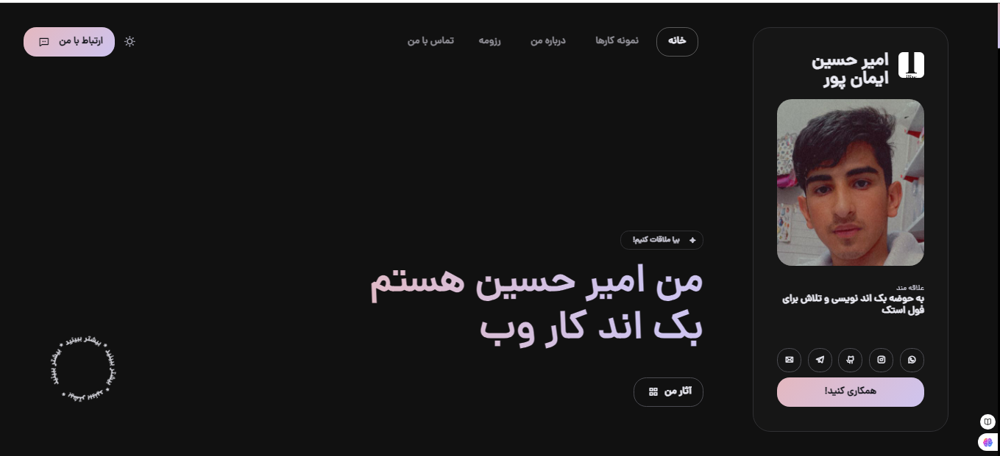

# Personal Portfolio Website  

This is a personal website designed as an online resume. It includes information about my skills, work experience, and projects.  

## Features  

- Home page featuring a brief introduction and profile picture  
- Skills and experience section  
- Portfolio showcasing projects  
- Contact form  

## Requirements  

To run this project, you need the following:  

- **PHP** (version 7.0 or higher)  
- **SQL  
## can see 
## [link!](http://amirhoseniliw.ir)  

</br></br>

# demo
  


## Installation Instructions  

Follow these steps to set up the project:  

1. **Clone the repository:**  

   ```bash  
   git clone https://github.com/amirhoseniliw/my-website.git
   ```
   <amirhoseniliw>/  
│  
├── index.php                  # Home page
│
├── public/                  
   │──  style/            
   │        └── style.css      # CSS files 
   │ ──  js/            
   │        └── app.js         # CSS files             
   └── images/                 # Images  
          └── profile.jpg      # Profile picture
   
